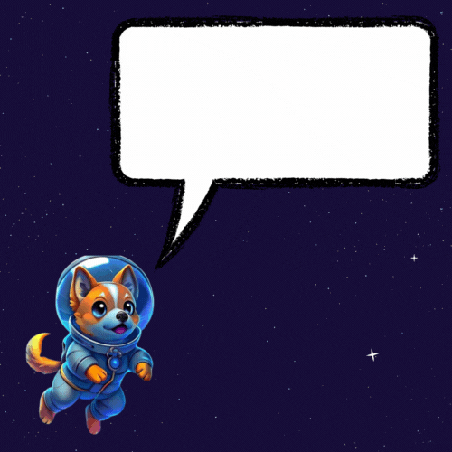
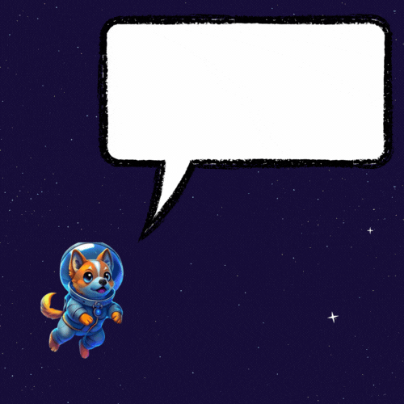
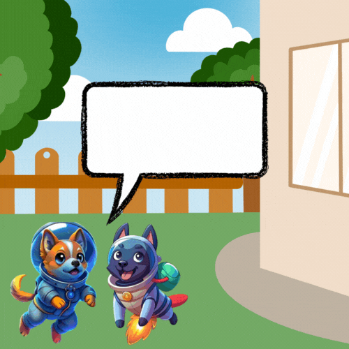

# guess-number Game

Luke and Mike are two dogs astronauts (astro-dogs). One day Mike got stuck on the **Tamon** planet and your brother Luke should rescue him. The problem is that Luke forgot some important code and our mission is to help Luke to discover those numbers. The game will sort numbers from 1 to 100 in a range of 10 numbers and will hide one by line, your mission will be to identify the missing number.

## Game age group

From 4 to 7 years. This game was developed to help childrens learn numbers from 1 to 100.

## Game Levels

**Level 1**

Your first goal is to identify one number at the first line. This number will open the rocket.

**Level 2**

The second goal is to identify two numbers at the second and third lines. Those numbers should to start the rocket.

**Level 3**

Now you need help Luke to identify the **Tamon** planet coordenates. You should to discover 3 number at the 4th, 5th, 6th and 7th lines

**Level 4**

Cool, Luke finally found Mike at **Tamon** planet. Now we should to help Mike and Luke discover the Earth coordenates. You should find 3 numbers at lines 8th, 9th and 10th.

## How to run?

You need the Java 11+ installed and Linux OS. Then download the version at [Releases](https://github.com/pedro-hos/guess-number/releases) page. Unzip the `dist.zip` file and execute the `astrodog.sh` file.

## Team

- [Pedro Hos](https://github.com/pedro-hos) - Developer 
- [Tais Monique Gonçalves](https://www.linkedin.com/in/ta%C3%ADs-monique-gon%C3%A7alves-66243145/) - Educational Coordinator
- [Pedro Valentim](https://github.com/pedro-valentim) - Image Creator